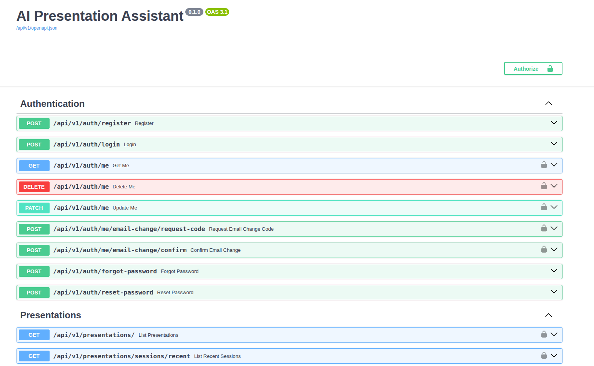
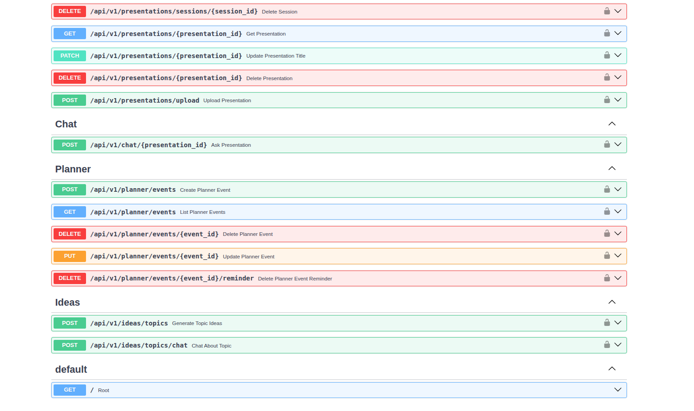

# API Reference

Base URL: `/api/v1`

All authenticated endpoints require `Authorization: Bearer <token>`.

## Auth

### POST `/auth/register`

Create a new user.

### POST `/auth/login`

Authenticate a user and return a JWT access token.

### GET `/auth/me`

Get the current user profile.

### PATCH `/auth/me`

Update the current user profile.

### POST `/auth/forgot-password`

Send a password reset email.

### POST `/auth/reset-password`

Reset password with a valid token.

### POST `/auth/me/email-change/request-code`

Send a verification code to a new email address.

### POST `/auth/me/email-change/confirm`

Confirm the email change with a verification code.

## Presentations

### GET `/presentations`

List presentations for the current user.

### GET `/presentations/{presentation_id}`

Get presentation details. Optional query: `include_slides=true`.

### POST `/presentations/upload`

Upload a PDF or PPTX. Validates file size and type.

### GET `/presentations/sessions/recent`

List recent presentation sessions.

### DELETE `/presentations/sessions/{session_id}`

Delete a session.

### POST `/presentations/generate`

Generate a structured `PresentationState` JSON from a topic.

## Chat (RAG)

### POST `/chat/{presentation_id}`

Ask a question about a presentation. Returns an answer and source slide numbers.

## Orchestration (WebSocket)

### WS `/orchestration/ws/presentation/{presentation_id}?token=...`

Real-time orchestration channel for intent-driven slide control.

## Ideas

### POST `/ideas/topics`

Generate presentation topic ideas.

### POST `/ideas/topics/chat`

Chat about a selected topic idea.

## Planner

### GET `/planner/events`

List planner events for a date.

### POST `/planner/events`

Create a planner event.

### PATCH `/planner/events/{event_id}`

Update a planner event.

### DELETE `/planner/events/{event_id}`

Delete a planner event.

